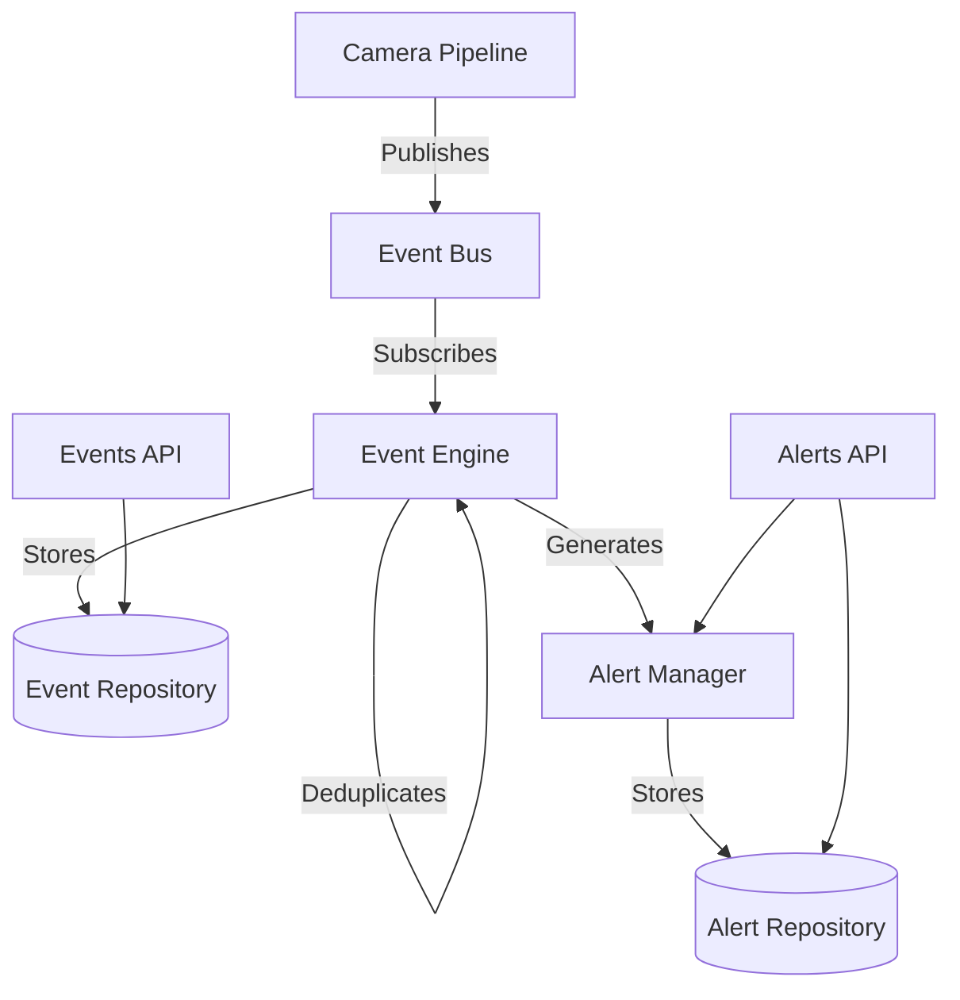

# Event & Alert Engine

The Event & Alert Engine (Phase 6) introduces a robust, non-blocking asynchronous event bus and an alert lifecycle management system to the IBVAP platform.

## Architecture Overview

### 1. Event Bus (`backend/app/core/event_bus.py`)
- Provides an asynchronous Pub/Sub pattern.
- Ensures components remain decoupled (the pipeline does not know about the event engine).
- Uses `asyncio` queues and worker tasks for non-blocking publishing.

### 2. Event Engine (`backend/app/services/event_engine.py`)
- Subscribes to the `events.intrusion` topic on the Event Bus.
- Deduplicates rapid successive events (e.g., when the same object triggers an event continuously in consecutive frames).
- Uses a configured cooldown window (`ALERT_COOLDOWN_SECONDS`) per object per fence per camera.
- Persists events via the `IEventRepository`.
- Triggers the Alert Manager for new distinct events.

### 3. Alert Manager (`backend/app/services/alert_manager.py`)
- Generates high-level actionable alerts from events.
- Manages the state machine of an alert (`NEW` -> `ACKNOWLEDGED` -> `RESOLVED` | `DISMISSED`).
- Persists alerts via the `IAlertRepository`.

### 4. Repositories (`backend/app/repositories/`)
- Abstracts data access behind `IEventRepository` and `IAlertRepository`.
- For the prototype phase, backed by bounded in-memory LRU/Deque implementations (`InMemoryEventRepository`, `InMemoryAlertRepository`) to prevent memory leaks while keeping it simple without a database dependency.

## API Endpoints

### Events
- `GET /api/v1/events/`: List events with optional filtering by `camera_id`, `event_type`, and `severity`.
- `GET /api/v1/events/{event_id}`: Retrieve a specific event.
- `GET /api/v1/events/statistics/count`: Get total event count with optional filters.

### Alerts
- `GET /api/v1/alerts/`: List alerts with optional filtering by `camera_id`, `status`, and `severity`.
- `GET /api/v1/alerts/{alert_id}`: Retrieve a specific alert.
- `PATCH /api/v1/alerts/{alert_id}/acknowledge`: Acknowledge a new alert (optionally supply `user_id`).
- `PATCH /api/v1/alerts/{alert_id}/resolve`: Mark an acknowledged alert as resolved.
- `PATCH /api/v1/alerts/{alert_id}/dismiss`: Dismiss an alert (false alarm).

## Configuration
Managed via environment variables / `backend/app/core/config.py`:
- `ALERT_COOLDOWN_SECONDS`: Deduplication window for alerts (default: 10s).
- `MAX_IN_MEMORY_EVENTS`: Capacity for the in-memory event repository (default: 1000).
- `MAX_IN_MEMORY_ALERTS`: Capacity for the in-memory alert repository (default: 500).
